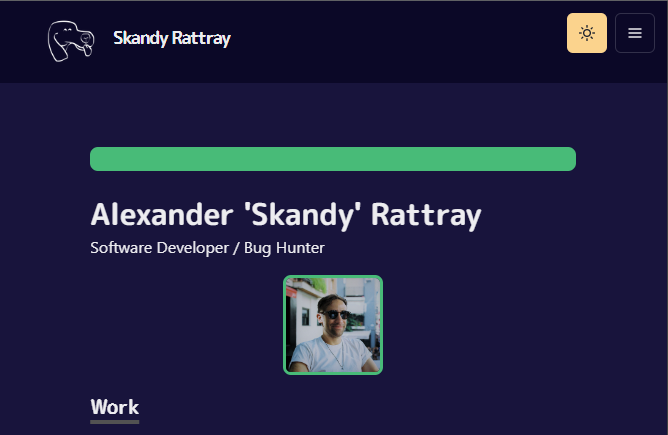

# Skanfolio

Portfolio site for Skandy. I built this site intially by following a tutorial by the talented [Takuya Matsuyama](https://github.com/craftzdog) and then 
going over everything and customising to both better understand everything that was being used and to make it my own.

http://p-skandog.vercel.app/

[](http://p-skandog.vercel.app/)


## Tech Stack

- [Next.js](https://nextjs.org/) - A React framework with hybrid static & server rendering, and route pre-fetching, etc.
- [Chakra UI](https://chakra-ui.com/) - A simple, modular and accessible component library for React
- [Framer Motion](https://www.framer.com/motion/) - Animation library for React
- [Emotion Styled Components](https://emotion.sh/docs/styled) - Styling library for React


## Structure

```
$ROOT
│   # Page files
├── pages
│   # React component files
├── components
│   # Non-react modules
├── lib
│   # Static files for images
└── public
```
